# Libft42

The aim of this project is to code a C library regrouping usual functions that
we’ll be allowed to use in all us other projects at 42.

The most part is in C library (see man). 
Others are'nt in the C library but it will be so usefull further. This functions are described in subject.

Bellow, some function's flowcharts  to understand how they are working. This was important when i thinked about their logic.

<h1>Part 1 - Libc Functions</h1>

<h2>ft_memset</h2>

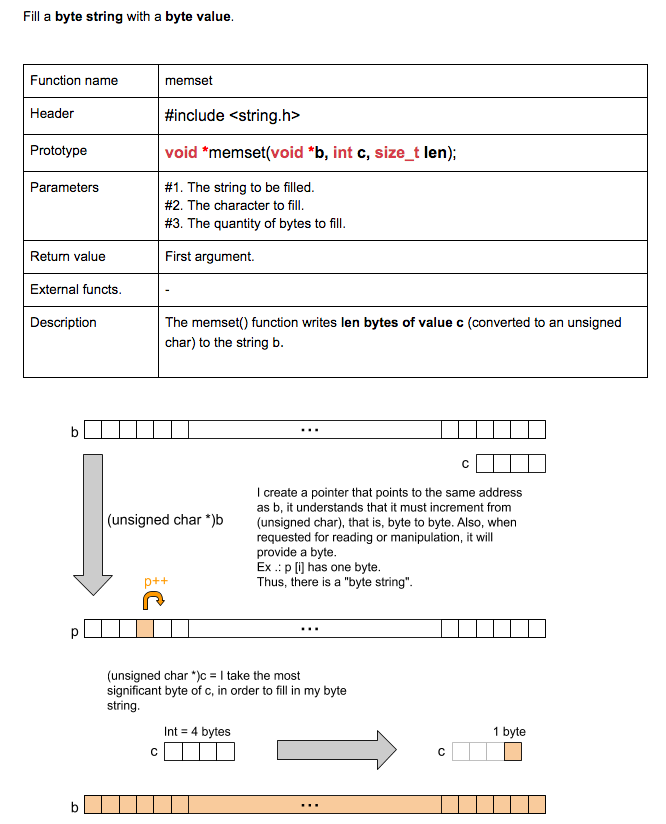

<h2>ft_memmov</h2>

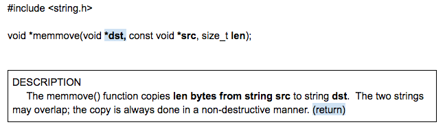

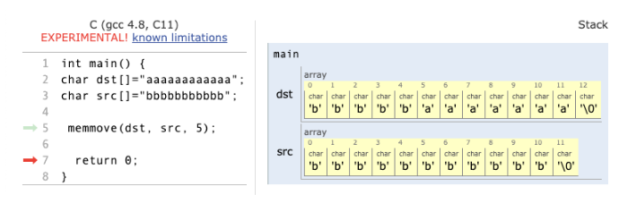

<h2>ft_calloc</h2>

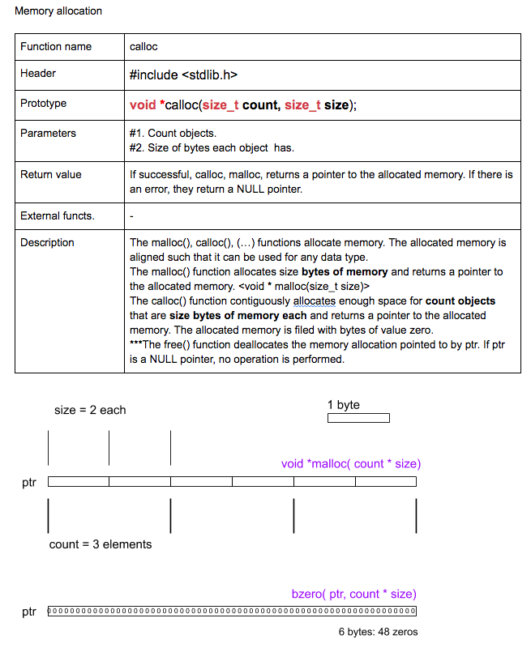

<h1>Part 2 - Additional Functions</h1>

<h2>ft_substr</h2>

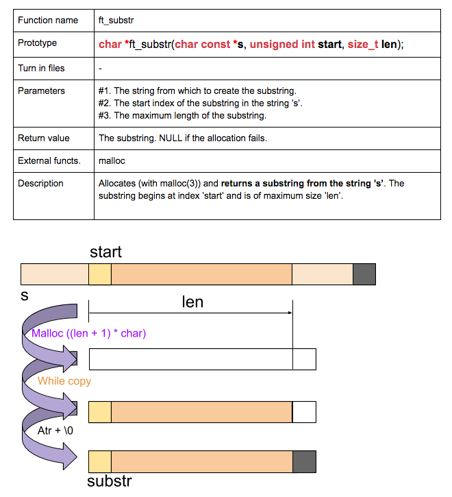

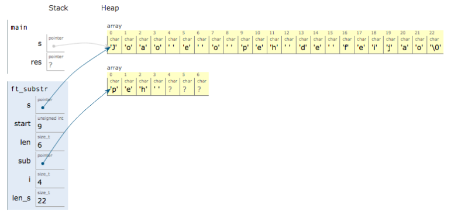

<h2>ft_strjoin</h2>

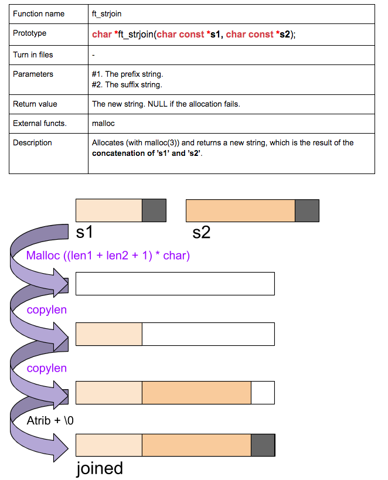

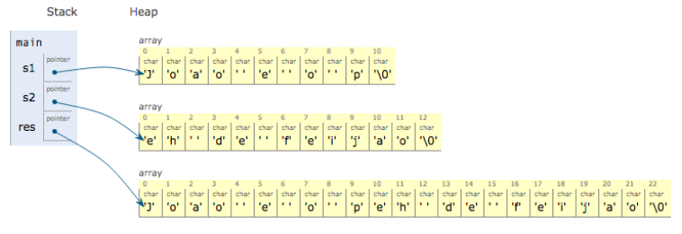

<h2>ft_strtrim</h2>

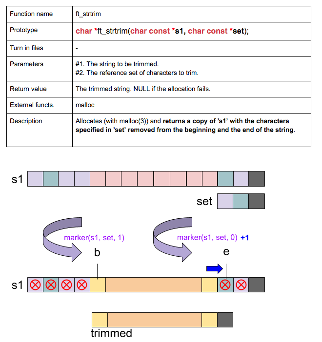

<h2>ft_split</h2>

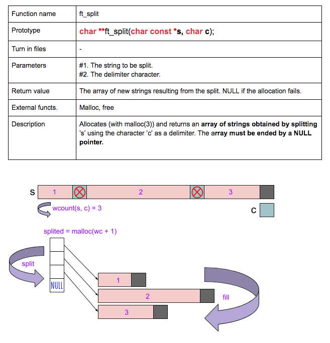

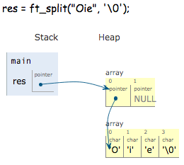

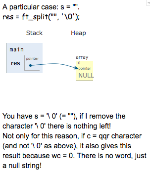

<h2>ft_itoa</h2>

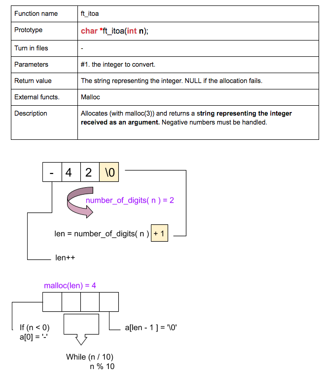

<h2>ft_strmapi</h2>

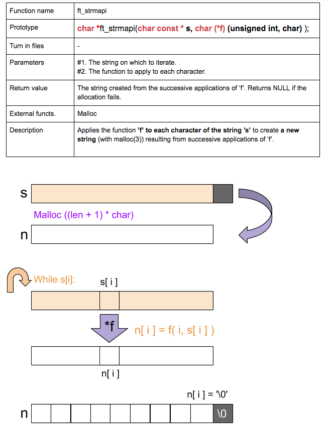

